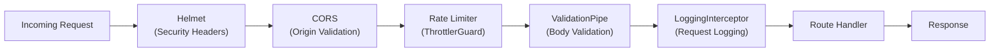
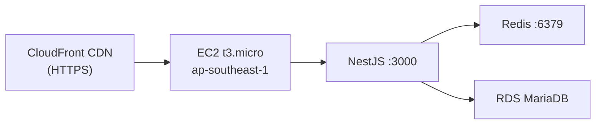

# Personal Task Tracker - API

REST API backend built with NestJS, TypeORM, and MariaDB. Includes security middleware (helmet, rate limiting, CORS) and structured request logging.

## Tech Stack

- **Runtime**: Node.js 20
- **Framework**: NestJS 11
- **ORM**: TypeORM
- **Database**: MariaDB
- **Cache**: Redis (via cache-manager)
- **Validation**: class-validator + class-transformer
- **Documentation**: Swagger/OpenAPI
- **Shared Logic**: personal-task-tracker-core

## API Endpoints

| Method | Endpoint | Description |
|--------|----------|-------------|
| `GET` | `/tasks` | List all tasks (optional `?status=TODO\|IN_PROGRESS\|DONE`) |
| `GET` | `/tasks/:id` | Get a task by ID |
| `POST` | `/tasks` | Create a new task |
| `PUT` | `/tasks/:id` | Update a task |
| `DELETE` | `/tasks/:id` | Delete a task |

## Task Model

```json
{
  "id": 1,
  "title": "Buy groceries",
  "description": "Milk, eggs, bread",
  "status": "TODO",
  "created_at": "2026-03-22T06:00:00.000Z"
}
```

**Status values**: `TODO` (default), `IN_PROGRESS`, `DONE`

## Security & Middleware



| Layer | Package | Configuration |
|-------|---------|--------------|
| **Helmet** | `helmet` | Default security headers (XSS, HSTS, CSP, etc.) |
| **CORS** | Built-in | Origin from `CORS_ORIGIN` env, credentials enabled |
| **Rate Limiting** | `@nestjs/throttler` | 10 req/s, 50 req/10s, 100 req/min per IP |
| **Body Validation** | `class-validator` | Whitelist mode, rejects unknown properties |
| **Logging** | Custom interceptor | Logs method, path, status, duration, IP, user-agent |

## Development

```bash
# Install dependencies
npm install

# Start development
npm run start:dev

# Build
npm run build

# Run tests
npm run test
```

## Environment Variables

Copy `.env.example` to `.env` and configure:

```env
DB_HOST=localhost
DB_PORT=3306
DB_USERNAME=root
DB_PASSWORD=password
DB_DATABASE=task_tracker
REDIS_HOST=localhost
REDIS_PORT=6379
PORT=3000
CORS_ORIGIN=http://localhost:3001
```

## Swagger Documentation

Available at `http://localhost:3000/api/docs` when running locally.

**Staging**: https://diofa9vowlzj6.cloudfront.net/api/docs
**Production**: https://d270j9db8ffegc.cloudfront.net/api/docs

## Tests

All 19 tests pass covering TasksService and TasksController.

```bash
npm run test        # Unit tests
npm run test:watch  # Watch mode
npm run test:cov    # Coverage
```

## Deployment

Deployed via the [orchestration repo](https://github.com/nurulizyansyaza/personal-task-tracker) CI/CD pipeline. The API runs on EC2 (ap-southeast-1) behind CloudFront CDN.


