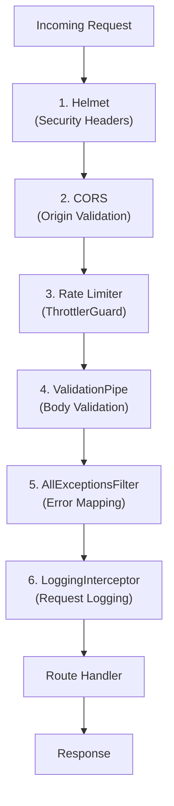
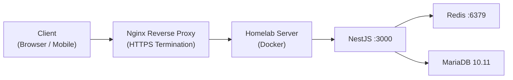
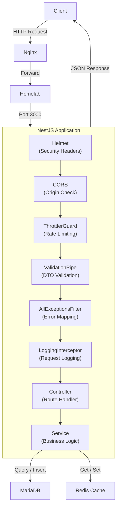

# Personal Task Tracker — API

A REST API for managing personal tasks, built with **NestJS 11**. It stores tasks in MariaDB, caches with Redis, validates every request, and returns consistent JSON responses. This README walks you through setup, usage, and architecture so you can get running in minutes.

---

## Table of Contents

1. [Tech Stack](#tech-stack)
2. [Quick Start](#quick-start)
3. [API Endpoints](#api-endpoints)
4. [Error Handling](#error-handling)
5. [Middleware Stack](#middleware-stack)
6. [Testing](#testing)
7. [Swagger API Docs](#swagger-api-docs)
8. [Bruno Collection](#bruno-collection)
9. [Project Structure](#project-structure)
10. [Environment Variables](#environment-variables)
11. [Deployment](#deployment)
12. [Architecture](#architecture)

---

## Tech Stack

| Technology | Version | Purpose |
|-----------|---------|---------|
| Node.js | 20 | Runtime |
| TypeScript | 5 | Language |
| NestJS | 11 | REST API framework |
| TypeORM | — | Database ORM for MariaDB |
| MariaDB | 10.11 | Relational database (via Docker container) |
| Redis (cache-manager) | — | Caching layer |
| class-validator + class-transformer | — | Request body validation |
| Swagger / OpenAPI | — | Interactive API documentation |
| personal-task-tracker-core | — | Shared types, validation, errors |

---

## Quick Start

### Prerequisites

| Tool | Version | How to check | How to install |
|------|---------|-------------|----------------|
| Node.js | 20 | `node -v` | [nodejs.org](https://nodejs.org/) |
| npm | >= 9 | `npm -v` | Included with Node.js |
| MariaDB | 10.11 | `mariadb --version` | [mariadb.org](https://mariadb.org/download/) |
| Redis | >= 7 | `redis-server --version` | [redis.io](https://redis.io/download) |

### Step 1 — Clone the repository

```bash
git clone https://github.com/nurulizyansyaza/personal-task-tracker.git
cd personal-task-tracker/personal-task-tracker-api
```

### Step 2 — Install dependencies

```bash
npm install
```

### Step 3 — Configure environment variables

```bash
cp .env.example .env
```

Open `.env` and fill in your database and Redis credentials (see [Environment Variables](#environment-variables) below).

### Step 4 — Start the development server

```bash
npm run start:dev
```

The API will be available at **http://localhost:3000**. Swagger docs are at **http://localhost:3000/api/docs**.

### Step 5 — Verify it works

```bash
curl http://localhost:3000/health
```

You should see:

```json
{
 "success": true,
 "data": { "status": "ok" },
 "message": "Service is healthy"
}
```

---

## API Endpoints

Every successful response follows this shape:

```json
{
 "success": true,
 "data": "...",
 "message": "Human-readable message"
}
```

### Endpoint Reference

| Method | Endpoint | Description |
|--------|----------|-------------|
| `GET` | `/health` | Health check (verifies DB connectivity) |
| `GET` | `/tasks` | List all tasks (optional `?status=TODO\|IN_PROGRESS\|DONE`) |
| `GET` | `/tasks/:id` | Get a single task by ID |
| `POST` | `/tasks` | Create a new task |
| `PUT` | `/tasks/:id` | Update an existing task |
| `DELETE` | `/tasks/:id` | Delete a task |

### Request & Response Examples

#### Create a task

```bash
curl -X POST http://localhost:3000/tasks \
 -H "Content-Type: application/json" \
 -d '{"title": "Buy groceries", "description": "Milk, eggs, bread"}'
```

**Response** `201 Created`:

```json
{
 "success": true,
 "data": {
 "id": 1,
 "title": "Buy groceries",
 "description": "Milk, eggs, bread",
 "status": "TODO",
 "created_at": "2026-03-22T06:00:00.000Z"
 },
 "message": "Task created successfully"
}
```

> **Tip:** `description` is optional. Only `title` is required.

#### List tasks with a status filter

```bash
curl http://localhost:3000/tasks?status=TODO
```

**Response** `200 OK`:

```json
{
 "success": true,
 "data": [
 {
 "id": 1,
 "title": "Buy groceries",
 "description": "Milk, eggs, bread",
 "status": "TODO",
 "created_at": "2026-03-22T06:00:00.000Z"
 }
 ],
 "message": "Tasks retrieved successfully"
}
```

#### Update a task

```bash
curl -X PUT http://localhost:3000/tasks/1 \
 -H "Content-Type: application/json" \
 -d '{"status": "IN_PROGRESS"}'
```

**Response** `200 OK`:

```json
{
 "success": true,
 "data": {
 "id": 1,
 "title": "Buy groceries",
 "description": "Milk, eggs, bread",
 "status": "IN_PROGRESS",
 "created_at": "2026-03-22T06:00:00.000Z"
 },
 "message": "Task updated successfully"
}
```

#### Delete a task

```bash
curl -X DELETE http://localhost:3000/tasks/1
```

**Response** `200 OK`:

```json
{
 "success": true,
 "data": null,
 "message": "Task deleted successfully"
}
```

#### Get a task by ID (not found)

```bash
curl http://localhost:3000/tasks/999
```

**Response** `404 Not Found`:

```json
{
 "success": false,
 "statusCode": 404,
 "error": "Not Found",
 "message": "Task with id 999 not found",
 "timestamp": "2026-03-22T06:00:00.000Z",
 "path": "/tasks/999"
}
```

---

## Error Handling

All errors are caught by a global `AllExceptionsFilter` and returned in a consistent format:

```json
{
 "success": false,
 "statusCode": 400,
 "error": "Bad Request",
 "message": "Validation failed",
 "errors": [
 {
 "code": "TITLE_REQUIRED",
 "message": "Title is required"
 }
 ],
 "timestamp": "2026-03-22T06:00:00.000Z",
 "path": "/tasks"
}
```

### How It Works

1. **DTOs** (`CreateTaskDto`, `UpdateTaskDto`) use `class-validator` decorators. Each decorator references a shared `ErrorCode` enum via `getErrorMessage(ErrorCode.XXX)`, so every validation message is consistent across the app.
2. **AllExceptionsFilter** catches everything thrown in the application and maps it to the `ApiErrorResponse` shape shown above.

### Exception Types Handled

| Exception | HTTP Status | When It Happens |
|-----------|-------------|-----------------|
| `HttpException` (validation) | 400 | Request body fails DTO validation |
| `HttpException` (not found) | 404 | Entity not found by ID |
| `ThrottlerException` | 429 | Rate limit exceeded |
| `QueryFailedError` | 500 | Database query error |
| `EntityNotFoundError` | 404 | TypeORM entity not found |
| Unknown / unhandled | 500 | Anything else |

---

## Middleware Stack

Every request passes through these layers **in order** before reaching your route handler:



| # | Layer | Package | What It Does |
|---|-------|---------|-------------|
| 1 | **Helmet** | `helmet` | Sets security headers (XSS protection, HSTS, CSP, etc.) |
| 2 | **CORS** | Built-in NestJS | Validates request origin against `CORS_ORIGIN` env variable; enables credentials |
| 3 | **Rate Limiting** | `@nestjs/throttler` | Limits per IP: **10 req/s**, **50 req/10 s**, **100 req/min** |
| 4 | **ValidationPipe** | `class-validator` | Validates request bodies; `whitelist: true` strips unknown fields; `forbidNonWhitelisted: true` rejects them with an error |
| 5 | **AllExceptionsFilter** | Custom | Global filter that catches all exceptions and maps them to the standard `ApiErrorResponse` |
| 6 | **LoggingInterceptor** | Custom | Logs every request: HTTP method, URL, response status code, and duration in ms |

---

## Testing

The project has **84 tests** across **17 test suites**.

### Unit Tests (12 suites, 74 tests)

Covers controllers, services, DTOs, filters, interceptors, configs, entities, and health.

```bash
npm test
```

### Integration Tests (5 suites, 10 tests)

Split by concern: health, CRUD workflow, validation errors, 404 handling, and status filtering.

```bash
npm run test:ptt-tomei
```

### Coverage

```bash
npm run test:cov
```

### What's Tested

| Area | Examples |
|------|----------|
| **Controllers** | Route handling, response shape, status codes |
| **Services** | Business logic, DB interactions (mocked) |
| **DTOs** | Validation rules, error messages |
| **Filters** | Exception-to-response mapping |
| **Interceptors** | Logging output |
| **Configs** | Database and Redis configuration loading |
| **Entities** | Entity definitions |
| **Health** | Health check endpoint and DB connectivity |
| **Integration** | Full CRUD workflow, validation, 404s, status filtering |

---

## Swagger API Docs

The API ships with interactive documentation powered by [Swagger / OpenAPI](https://swagger.io/). Every endpoint, request body, query parameter, and response schema is documented — you can test requests directly from the browser.

### Accessing Swagger UI

| Environment | URL |
|-------------|-----|
| **Local** | [http://localhost:3000/api/docs](http://localhost:3000/api/docs) |
| **Staging** | `https://staging-ptt.nurulizyansyaza.com/api/docs` |
| **Production** | `https://ptt.nurulizyansyaza.com/api/docs` |

### How to Use

1. Start the API server locally (`npm run start:dev`) or use a deployed URL above.
2. Open the Swagger URL in your browser.
3. You will see all endpoints grouped under **Tasks** and **Health** tags.
4. Click any endpoint to expand it — you will see:
   - **Parameters** — path params (`:id`), query params (`?status=`)
   - **Request body** — required and optional fields with examples
   - **Responses** — success and error schemas with status codes
5. Click **"Try it out"** on any endpoint, fill in the fields, and click **"Execute"** to send a real request.
6. The response body, status code, and headers appear below.

### What's Documented

- All CRUD endpoints with typed request/response schemas
- Success response wrapper: `{ success: boolean, data: T, message?: string }`
- Error response structure: `{ success: false, statusCode, error, message, errors[], timestamp, path }`
- Enum values for `TaskStatus` (TODO, IN_PROGRESS, DONE)
- Validation constraints (title max length, description max length)
- 400, 404, and 500 error responses on every endpoint

---

## Bruno Collection

The `bruno/` directory contains **23 pre-built API requests** you can use to explore the API interactively with [Bruno](https://www.usebruno.com/) (a free, open-source API client).

### Setup

1. Install [Bruno](https://www.usebruno.com/downloads).
2. Open Bruno → **Open Collection** → navigate to the `bruno/` folder in this repo.
3. Select an environment: **Local**, **Staging**, or **Production**.

### Available Requests

| Folder | Requests | Purpose |
|--------|----------|---------|
| `health` | 2 | Health check, Swagger docs |
| `tasks` | 8 | Core CRUD operations |
| `tasks-validation` | 7 | Validation edge cases (missing title, invalid status, etc.) |
| `tasks-errors` | 6 | Error scenarios (not found, bad ID, etc.) |

### Environments

| Environment | Base URL |
|-------------|----------|
| **Local** | `http://localhost:3000` |
| **Staging** | `https://staging-ptt.nurulizyansyaza.com/api` |
| **Production** | `https://ptt.nurulizyansyaza.com/api` |

---

## Project Structure

```
src/
├── app.module.ts # Root module — imports all feature modules
├── app.controller.ts # Root controller
├── app.service.ts # Root service
├── main.ts # Bootstrap — applies middleware, starts server
├── common/
│ ├── dto/response.dto.ts # Swagger response schemas (success + error wrappers)
│ ├── filters/all-exceptions.filter.ts # Global exception filter (ApiErrorResponse)
│ └── interceptors/logging.interceptor.ts # Logs method, url, status, duration
├── config/
│ ├── database.config.ts # TypeORM / MariaDB configuration
│ └── redis.config.ts # Redis / cache-manager configuration
├── health/
│ ├── health.module.ts # Health check module
│ ├── health.controller.ts # GET /health
│ └── health.service.ts # DB connectivity check
└── tasks/
 ├── tasks.module.ts # Tasks feature module
 ├── tasks.controller.ts # CRUD route handlers
 ├── tasks.service.ts # Business logic + DB queries
 ├── dto/create-task.dto.ts # Validation for POST /tasks
 ├── dto/update-task.dto.ts # Validation for PUT /tasks/:id
 └── entities/task.entity.ts # TypeORM entity (id, title, description, status, created_at)
```

---

## Environment Variables

Copy `.env.example` to `.env` and fill in the values:

```bash
cp .env.example .env
```

| Variable | Description | Example |
|----------|-------------|---------|
| `DB_HOST` | MariaDB host | `localhost` |
| `DB_PORT` | MariaDB port | `3306` |
| `DB_USERNAME` | Database user | `root` |
| `DB_PASSWORD` | Database password | `password` |
| `DB_DATABASE` | Database name | `task_tracker` |
| `REDIS_HOST` | Redis host | `localhost` |
| `REDIS_PORT` | Redis port | `6379` |
| `PORT` | API server port | `3000` |
| `CORS_ORIGIN` | Allowed CORS origin | `http://localhost:3001` |

---

## Deployment

The API is deployed via the [orchestration repo](https://github.com/nurulizyansyaza/personal-task-tracker) CI/CD pipeline.

| Environment | URL | Swagger Docs |
|-------------|---------------|-------------|
| **Staging** | `https://staging-ptt.nurulizyansyaza.com/api` | [/api/docs](https://staging-ptt.nurulizyansyaza.com/api/docs) |
| **Production** | `https://ptt.nurulizyansyaza.com/api` | [/api/docs](https://ptt.nurulizyansyaza.com/api/docs) |

### Infrastructure



---

## Architecture

This diagram shows the full lifecycle of a request through the application:



---

## Related Repositories

| Repo | Description | Tests |
|------|-------------|-------|
| [personal-task-tracker](https://github.com/nurulizyansyaza/personal-task-tracker) | Orchestration — CI/CD, Docker, homelab infra | — |
| [personal-task-tracker-core](https://github.com/nurulizyansyaza/personal-task-tracker-core) | Shared TypeScript library — types, validation, errors | 41 |
| [personal-task-tracker-api](https://github.com/nurulizyansyaza/personal-task-tracker-api) | NestJS REST API with security middleware | 74 |
| [personal-task-tracker-frontend](https://github.com/nurulizyansyaza/personal-task-tracker-frontend) | Next.js Kanban dashboard | 96 |
